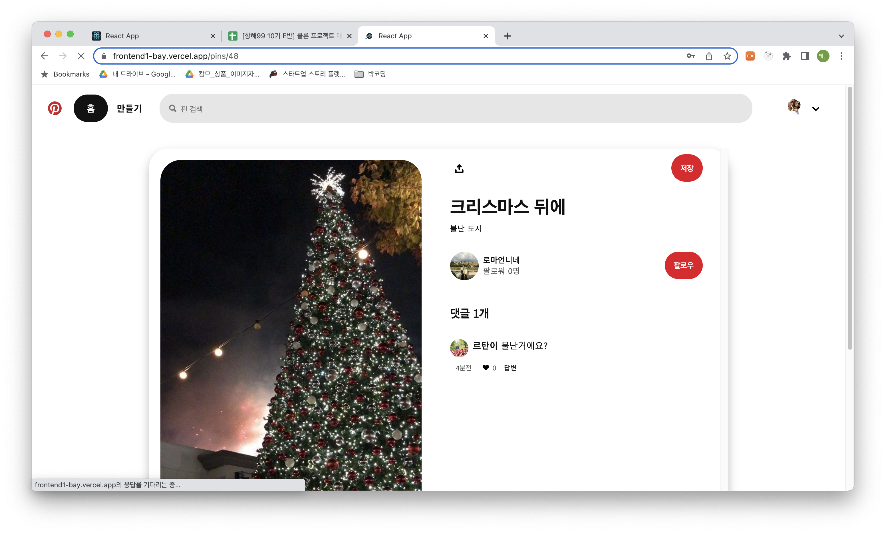

# 항해 10기 E반 Pinterest-Clone Frontend

# 1조 Pinterest-Clone

- 프로젝트 소개 : 이미지 위주의 UI와 CRUD 기능에 충실한 핀터레스트를 클론코딩해보았습니다.

- frontend : React, backend : NodeJS

---

## 실행화면 및 배포주소 (최종 배포 후 작성)

![핀터레스트1]](src/assets/images/screenshot 1.png)

https://frontend1-bay.vercel.app/

---

## 사용 패키지

- react, @reduxjs/toolkit, axios, react-dom, react-redux, react-router-dom, react-scripts, styled-components, react-infinitegrid, browser-image-compression, jwt-decode, storybook

---

## trouble shooting (FE)

---

- 발생
  마이페이지에 접속했을때 Uncaught TypeError: Cannot read property

- 원인
  회원 정보를 로드되기 전에 렌더링이 되면서 에러가 나는 문제

- 해결
  회원정보가 로드되지 않으면 return 되도록하는 코드를 추가하여 렌더링을 지연시킴

---

- 발생
  화면이 로드되면서 Uncaught Error: Maximum update depth exceeded.

- 원인
  onClick event에 화살표 함수를 포함하지 않아 렌더링과 동시에 함수가 작동하여 발생한 문제

- 해결
  화살표 함수를 사용해서 에러가 나오지 않았다.

---

- 발생

- 원인

- 해결

---

- 발생

- 원인

- 해결

---

- 발생

- 원인

- 해결

---

## 코드리뷰

- 1번리뷰 :

- 2번리뷰 :

- 3번리뷰 :

- 4번리뷰 :

---
